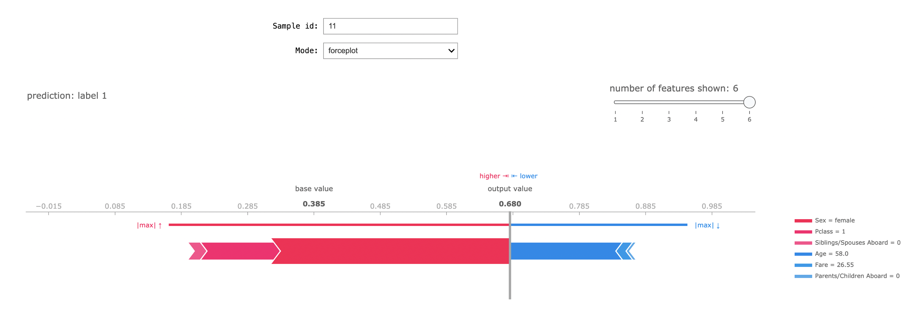
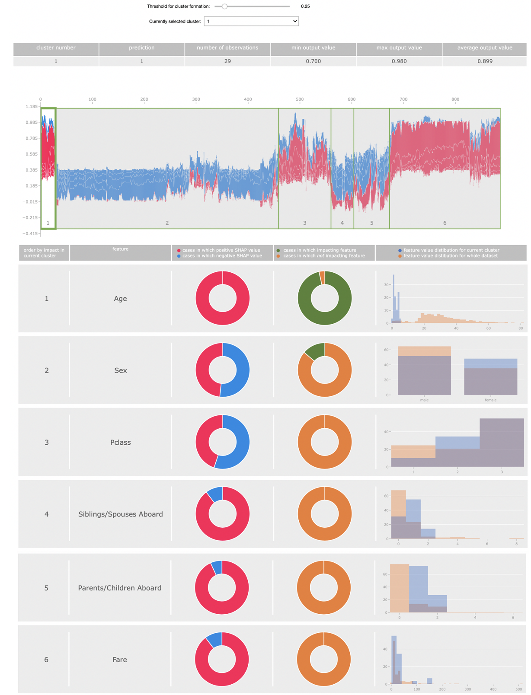

# MyExplainers

MyExplainers is a tool that can be used to visualize explanations of classifiers produced by SHAP. It offers two plots - one for local and one for global interpretation of classifiers.

In the following two youtube videos we explain how to interpret the information shown in the plots. We also compare them to SHAP's forceplot, summary plot and stacked forceplot.

### local interpretation plot: 
https://www.youtube.com/watch?v=y-EK-3a7VsE&feature=youtu.be. 

### global interpretation plot: 
https://youtu.be/VybwihOAJVM 


## Install

In the folder my_explainers you will find the implementation of the tool. In order to install it, navigate into this folder and execute the following command:

  ```bash
  pip install .
  ```

## Example Notebooks

In this folder you will find three notebooks showing how to use the my_explainers.


## Datasets

In this folder you will find three datasets that are needed to execute the notebooks in the folder Example_Notebooks.


## my_local_explainer

```python
import shap
import pandas as pd
import copy
from sklearn.ensemble import RandomForestClassifier
from sklearn.model_selection import train_test_split
from my_explainers import my_global_explainer, my_local_explainer, get_clusters

#import dataset
data = pd.read_csv("../datasets/titanic.csv")

#split data into X and y
X, y = data.loc[:, data.columns != 'Survived'], data['Survived']

#save original (not encoded or scaled) data for later
original_data = copy.copy(X)

#encode the categorical variable "Sex"
X = pd.get_dummies(X, ['Sex'])

#split in train and test data
X_train,X_test,y_train,y_test = train_test_split(X,y,test_size=1/3,random_state=42, stratify=y)

#train random forest
rforest = RandomForestClassifier(n_estimators=100, max_depth=None, min_samples_split=2, random_state=0)
rforest.fit(X_train, y_train)

#create explainer and compute shap values
explainer = shap.TreeExplainer(rforest)
shap_values = explainer.shap_values(X, check_additivity=False)

#construct decoder for encoded variables
decoder = {"Sex":  ["Sex_male", "Sex_female"] }

my_local_explainer(explainer.expected_value[1], shap_values[1], rforest, original_data, X, 1, decoder)

```




## my_global_explainer

```python

my_global_explainer(explainer.expected_value[1], shap_values[1], rforest, original_data, X, 1, decoder)

```




